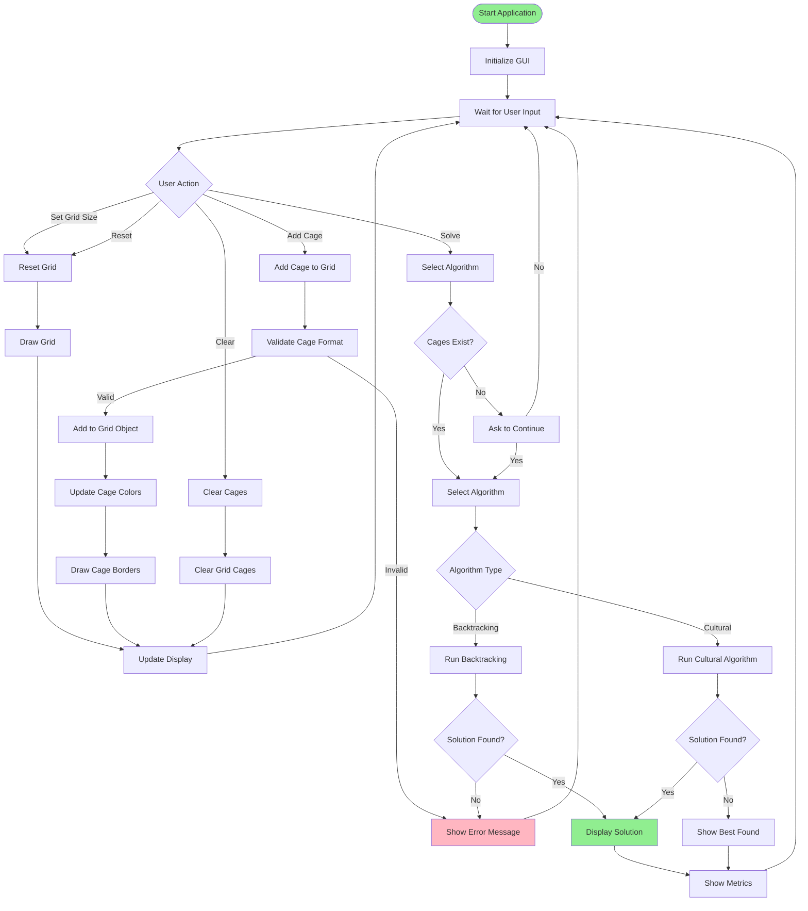
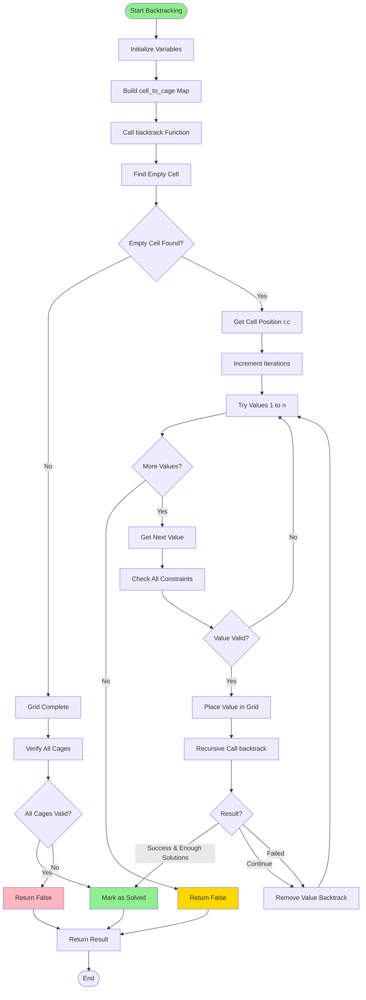
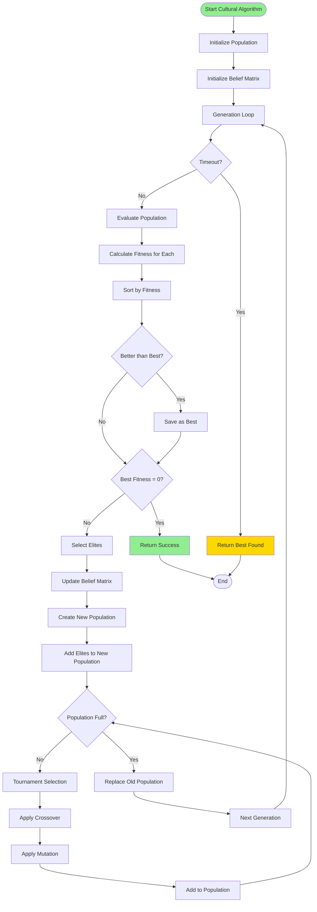
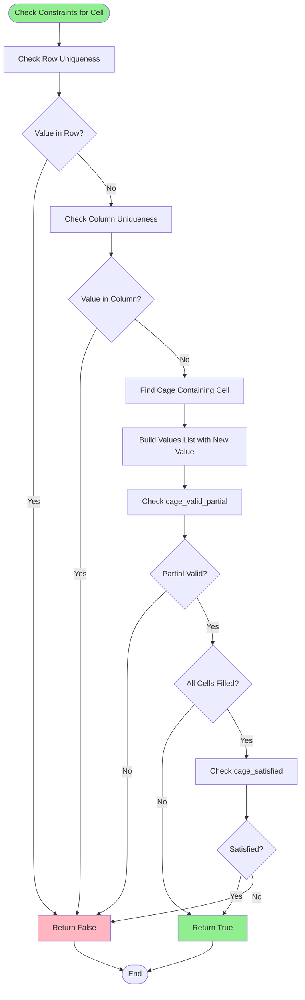

# KenKen Solver - Block Diagrams & Flowcharts

## 1. Block Diagram - System Architecture

```
┌─────────────────────────────────────────────────────────────┐
│                      KenKen Solver                            │
│                      (Main Application)                      │
└──────────────────────────┬────────────────────────────────────┘
                           │
                           ▼
        ┌──────────────────────────────────────┐
        │         GUI Layer (gui.py)           │
        │  ┌──────────────────────────────┐   │
        │  │   KenKenGUI Class            │   │
        │  │  - User Interface            │   │
        │  │  - Input Handling            │   │
        │  │  - Display Management        │   │
        │  │  - ScrollableFrame           │   │
        │  └──────────────────────────────┘   │
        └──────────────┬───────────────────────┘
                       │
        ┌──────────────┴───────────────┐
        │                              │
        ▼                              ▼
┌───────────────┐            ┌──────────────────┐
│  Grid Module  │            │  Solver Modules   │
│  (grid.py)    │            │                  │
│               │            │  ┌──────────────┐ │
│  KenKenGrid   │            │  │ Backtracking│ │
│  - Grid Data  │            │  │  Algorithm  │ │
│  - Cages      │            │  └──────────────┘ │
│  - Operations │            │                  │
└───────┬───────┘            │  ┌──────────────┐ │
        │                     │  │   Cultural   │ │
        │                     │  │  Algorithm   │ │
        │                     │  └──────────────┘ │
        │                     └──────────────────┘
        │                              │
        └──────────────┬───────────────┘
                       │
                       ▼
        ┌──────────────────────────────┐
        │   Constraints Module          │
        │   (constraints.py)            │
        │  ┌────────────────────────┐  │
        │  │ - valid_in_row_col()    │  │
        │  │ - cage_valid_partial()  │  │
        │  │ - cage_satisfied()      │  │
        │  │ - check_all_constraints()│  │
        │  └────────────────────────┘  │
        └──────────────────────────────┘
```

## 2. Flowchart - Main Application Flow



## 3. Flowchart - Backtracking Algorithm



## 4. Flowchart - Cultural Algorithm



## 5. Flowchart - Constraint Checking



## 6. Flowchart - Cage Validation (Partial)

```mermaid
flowchart TD
    Start([cage_valid_partial]) --> GetFilled[Get Filled Values]
    GetFilled --> CheckEmpty{Any Filled?}
    
    CheckEmpty -->|No| ReturnTrue[Return True - Conservative]
    CheckEmpty -->|Yes| CheckOp{Operation Type?}
    
    CheckOp -->|+| CheckSum[Check Sum]
    CheckOp -->|*| CheckProd[Check Product]
    CheckOp -->|-| CheckDiff[Check Difference]
    CheckOp -->|/| CheckDiv[Check Division]
    CheckOp -->|=| CheckEqual[Check Equality]
    
    CheckSum --> SumGT{Sum > Target?}
    SumGT -->|Yes| ReturnFalse[Return False]
    SumGT -->|No| SumEQ{Sum = Target?}
    SumEQ -->|Yes| AllFilled{All Cells Filled?}
    SumEQ -->|No| ReturnTrue
    
    AllFilled -->|No| ReturnFalse
    AllFilled -->|Yes| ReturnTrue
    
    CheckProd --> ProdGT{Product > Target?}
    ProdGT -->|Yes| ReturnFalse
    ProdGT -->|No| ProdEQ{Product = Target?}
    ProdEQ -->|Yes| AllFilled
    ProdEQ -->|No| ReturnTrue
    
    CheckDiff --> BothFilled{Both Cells Filled?}
    BothFilled -->|Yes| CheckAbsDiff[Check |a-b| = Target]
    BothFilled -->|No| ReturnTrue
    CheckAbsDiff -->|Yes| ReturnTrue
    CheckAbsDiff -->|No| ReturnFalse
    
    CheckDiv --> BothFilled2{Both Cells Filled?}
    BothFilled2 -->|Yes| CheckDivOp[Check a/b or b/a = Target]
    BothFilled2 -->|No| ReturnTrue
    CheckDivOp -->|Yes| ReturnTrue
    CheckDivOp -->|No| ReturnFalse
    
    CheckEqual --> ValEQ{Value = Target?}
    ValEQ -->|Yes| ReturnTrue
    ValEQ -->|No| ReturnFalse
    
    ReturnTrue --> End([End])
    ReturnFalse --> End
    
    style Start fill:#90EE90
    style ReturnTrue fill:#90EE90
    style ReturnFalse fill:#FFB6C1
```

## 7. Component Interaction Diagram

```
┌──────────────┐
│   User       │
└──────┬───────┘
       │
       ▼
┌─────────────────────────────────────┐
│         GUI (KenKenGUI)             │
│                                     │
│  ┌────────────┐  ┌──────────────┐ │
│  │   Input    │  │   Display    │ │
│  │  Handler   │  │   Manager    │ │
│  └─────┬──────┘  └──────┬───────┘ │
│        │                │          │
│        │                │          │
│        ▼                ▼          │
│  ┌──────────────────────────────┐ │
│  │      Grid Operations          │ │
│  └──────────────┬───────────────┘ │
└──────────────────┼─────────────────┘
                   │
        ┌───────────┴───────────┐
        │                        │
        ▼                        ▼
┌──────────────┐      ┌──────────────────┐
│ KenKenGrid   │      │   Constraints    │
│              │      │                  │
│ - grid[][]   │◄─────┤ - Row/Col Check  │
│ - cages[]    │      │ - Cage Check     │
│              │      │ - Partial Valid  │
└──────┬───────┘      └──────────────────┘
       │
       │
       ▼
┌─────────────────────────────────────┐
│      Solver Selection              │
│                                     │
│  ┌──────────────┐  ┌────────────┐ │
│  │ Backtracking  │  │  Cultural  │ │
│  │               │  │            │ │
│  │ - Recursive   │  │ - Pop-based│ │
│  │ - Systematic  │  │ - Belief   │ │
│  └───────┬───────┘  └──────┬─────┘ │
│          │                 │       │
│          └────────┬────────┘       │
│                   │                │
│                   ▼                │
│          ┌─────────────────┐      │
│          │  Use Constraints │      │
│          └─────────────────┘      │
└─────────────────────────────────────┘
```

## 8. Data Flow Diagram

```
┌─────────────┐
│ User Input  │
│ - Grid Size │
│ - Cages     │
└──────┬──────┘
       │
       ▼
┌─────────────────┐
│  GUI Processing │
│  - Validate      │
│  - Store         │
└──────┬───────────┘
       │
       ▼
┌─────────────────┐      ┌──────────────┐
│  KenKenGrid     │──────┤  Constraints │
│  Data Structure │      │  Validator   │
│                 │      │              │
│  grid: int[][]  │      │  - Row/Col   │
│  cages: Cage[]  │      │  - Cage Rules │
└──────┬──────────┘      └──────────────┘
       │
       │
       ▼
┌─────────────────┐
│  Solver Engine  │
│                 │
│  ┌───────────┐ │
│  │ Backtrack  │ │
│  └─────┬─────┘ │
│        │       │
│  ┌─────▼─────┐ │
│  │ Cultural  │ │
│  └─────┬─────┘ │
└────────┼────────┘
         │
         ▼
┌─────────────────┐
│  Solution Grid  │
│  (Filled)       │
└────────┬────────┘
         │
         ▼
┌─────────────────┐
│  Display Result │
│  - Grid Values  │
│  - Metrics      │
└─────────────────┘
```

## 9. Class Diagram

```
┌─────────────────────┐
│    KenKenGUI        │
├─────────────────────┤
│ + root              │
│ + grid_obj          │
│ + cells[][]         │
│ + scrollable        │
├─────────────────────┤
│ + __init__()        │
│ + reset()           │
│ + add_cage()        │
│ + draw_grid()       │
│ + solve()           │
│ + update_cage_colors()│
└──────────┬──────────┘
           │ uses
           ▼
┌─────────────────────┐
│    KenKenGrid       │
├─────────────────────┤
│ + n: int            │
│ + grid: int[][]     │
│ + cages: Cage[]     │
├─────────────────────┤
│ + add_cage()        │
│ + get_cages()       │
│ + get_cell()        │
│ + set_cell()        │
└──────────┬──────────┘
           │ uses
           ▼
┌─────────────────────┐
│   Constraints       │
├─────────────────────┤
│ + valid_in_row_col()│
│ + cage_valid_partial()│
│ + cage_satisfied()   │
│ + check_all_constraints()│
└─────────────────────┘

┌─────────────────────┐
│  Backtracking       │
├─────────────────────┤
│ + solve_backtracking()│
│ - find_empty_cell() │
│ - backtrack()       │
└─────────────────────┘

┌─────────────────────┐
│ CulturalAlgorithm   │
├─────────────────────┤
│ + solve()           │
│ - fitness()         │
│ - update_belief()   │
│ - crossover()       │
│ - mutate()          │
└─────────────────────┘
```

## 10. Sequence Diagram - Solving Process

```
User    GUI      Grid      Constraints  Solver
 │       │        │            │          │
 │──Add──>│        │            │          │
 │       │──Add───>│            │          │
 │       │<───────│            │          │
 │       │        │            │          │
 │──Solve>│        │            │          │
 │       │        │            │          │
 │       │───────────Check─────>│          │
 │       │<──────────Valid──────│          │
 │       │        │            │          │
 │       │─────────────────────Solve─────>│
 │       │        │            │          │
 │       │        │<───Check───│          │
 │       │        │───Valid───>│          │
 │       │        │            │          │
 │       │<──────────────────Solution──────│
 │       │──Update──>│            │          │
 │<──Show──│        │            │          │
```

---

## Notes

- **Block Diagrams**: Show the overall system architecture and relationships between components
- **Flowcharts**: Illustrate the workflow for each algorithm and main process
- **Component Interaction**: Shows how components interact with each other
- **Data Flow**: Illustrates data flow from inputs to outputs
- **Class Diagram**: Shows the class structure and relationships between them
- **Sequence Diagram**: Shows the sequence of operations when solving the puzzle

